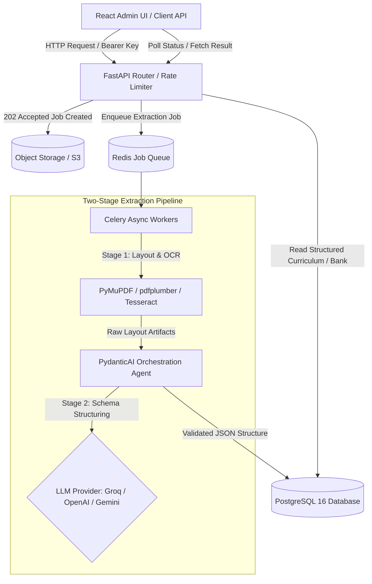

# AI Content Extraction Services Platform

[](https://fastapi.tiangolo.com/)
[](https://reactjs.org/)
[](https://www.typescriptlang.org/)
[](https://github.com/pydantic/pydantic-ai)
[](https://www.docker.com/)
[](https://www.python.org/)

Production-grade AI backend services and administrative dashboard designed for **WML (Work Order 1)**. The platform automatically ingests unstructured academic documents (syllabi, course guidelines, and previous question papers), processes visual & textual layouts using multi-stage OCR, extracts structured JSON schemas via LLMs, and exposes scalable REST APIs.

---

## 🌟 Key Capabilities

- 📄 **Syllabus → Curriculum Hierarchy Extraction**
  Extracts hierarchical curriculum trees (`Program → Semester/Year → Subject → Unit → Topic → Sub-topic`) complete with credit hours, course objectives, learning outcomes, and recommended reference books.

- 📝 **Question Paper → Question Bank Parsing**
  Parses exam papers into atomic question banks with metadata (total marks, question type, Bloom's Taxonomy cognitive level, sub-questions, and diagram requirement flags).

- 🔗 **Intelligent Topic Linker Agent**
  Employs LLM-driven semantic matching to auto-link extracted questions directly to corresponding curriculum unit topics.

- ⚡ **Asynchronous Job Pipeline**
  Implements non-blocking HTTP 202 Accepted processing via **Celery + Redis** worker queues, allowing clients to poll job status or configure asynchronous webhooks.

- 🔌 **Provider-Agnostic LLM Orchestration**
  Built on top of **PydanticAI** with auto-retry validation loops. Supports seamlessly switching between **Groq** (`llama-3.3-70b-versatile`), **OpenAI** (`gpt-4o`, `gpt-4.1`), and **Google Gemini** (`gemini-2.0-flash`).

---

## 🏗 System Architecture



---

## 📁 Repository Structure

```
.
├── backend/
│   ├── app/
│   │   ├── agents/          # PydanticAI structured extraction agents & prompts
│   │   ├── api/v1/          # FastAPI routers (health, syllabus, questions, bank)
│   │   ├── schemas/         # Pydantic v2 data models & JSON schemas
│   │   ├── services/        # Storage, Auth rate limiting, Ingestion & OCR services
│   │   ├── config.py        # Centralized BaseSettings environment configuration
│   │   ├── main.py          # FastAPI application entrypoint & middleware
│   │   └── worker.py        # Celery task definitions & Redis queue worker
│   ├── tests/               # Pytest suite (unit, schema validation, OCR, agents)
│   └── requirements.txt     # Python dependencies
├── frontend/
│   ├── src/                 # React 18 + TypeScript admin dashboard UI
│   │   ├── api/             # API client & job polling helpers
│   │   ├── App.tsx          # Main dashboard view & document uploader
│   │   └── main.tsx         # React entrypoint
│   ├── package.json         # Frontend dependencies & scripts
│   └── vite.config.ts       # Vite build configuration
├── infra/
│   ├── docker-compose.yml   # Full stack composition (Postgres, Redis, API, Worker, UI)
│   ├── backend.Dockerfile   # Multi-stage Python build with Tesseract & Poppler
│   └── frontend.Dockerfile  # Multi-stage Node + Nginx production container
├── DECISIONS.md             # Architectural Decisions Log
├── README.md                # Project documentation
└── package.json             # Root monorepo scripts
```

---

## 🚀 Quick Start (Docker Compose)

The fastest way to spin up the full stack (Database, Redis, Async Workers, API, and Admin Dashboard) is using Docker Compose:

### 1. Clone & Configure Environment
```bash
git clone https://github.com/Manindra-babu/AI-Content-Extraction.git
cd AI-Content-Extraction

# Copy default environment configuration
cp .env.example .env
```
*Update `.env` with your desired LLM credentials (e.g., `GROQ_API_KEY`, `OPENAI_API_KEY`, or `GEMINI_API_KEY`).*

### 2. Launch Stack
```bash
docker compose -f infra/docker-compose.yml up --build -d
```

### 3. Service Access Links
- 🎨 **Admin / Demo UI:** [http://localhost:5173](http://localhost:5173)
- 📖 **Swagger OpenAPI Specs:** [http://localhost:8000/docs](http://localhost:8000/docs)
- 🔍 **ReDoc Documentation:** [http://localhost:8000/redoc](http://localhost:8000/redoc)
- 💚 **API Health Endpoint:** [http://localhost:8000/v1/health](http://localhost:8000/v1/health)

---

## 🛠 Manual Local Development Setup

If you prefer running services directly on your host machine:

### Backend Setup (FastAPI & Celery)
```bash
cd backend

# Create virtual environment
python -m venv .venv
# On Windows:
.venv\Scripts\activate
# On Linux/macOS:
source .venv/bin/activate

# Install dependencies
pip install -r requirements.txt

# Run FastAPI Development Server
uvicorn app.main:app --reload --port 8000
```

To start a Celery worker for async job processing:
```bash
celery -A app.worker.celery_app worker --loglevel=info
```

### Frontend Setup (React + Vite)
```bash
cd frontend

# Install dependencies
npm install

# Start Vite Dev Server
npm run dev
```

---

## 📡 API Reference Overview

All API endpoints are prefixed with `/v1` and require an `X-API-Key` header (e.g., `wml_dev_key_2026`).

| Method | Endpoint | Description |
| :--- | :--- | :--- |
| `GET` | `/v1/health` | Health check endpoint returning service status & timestamps |
| `POST` | `/v1/syllabus/upload` | Upload syllabus document (PDF/DOCX) for asynchronous curriculum tree extraction |
| `GET` | `/v1/syllabus/jobs/{job_id}` | Poll status & retrieve extracted curriculum hierarchy JSON |
| `POST` | `/v1/questions/upload` | Upload question paper for atomic question bank extraction & tagging |
| `GET` | `/v1/questions/jobs/{job_id}` | Poll status & retrieve parsed question paper JSON |
| `GET` | `/v1/question-bank/questions` | Query structured question bank with optional topic filtering |
| `POST` | `/v1/question-bank/link` | Trigger semantic topic linking between question paper and curriculum tree |

---

## 🧪 Testing & Quality Assurance

### Backend Unit & Integration Tests
Run the comprehensive Pytest suite covering authentication middleware, OCR parsing, agent validation, and schema definitions:

```bash
pytest backend/tests
```

### Frontend Type Safety & Production Build
Validate TypeScript definitions and create production bundle:

```bash
cd frontend
npm run build
```

---

## ⚙ Key Environment Variables

| Variable | Default Value | Description |
| :--- | :--- | :--- |
| `PROJECT_NAME` | `"AI Content Extraction Service"` | Service display name |
| `LLM_PROVIDER` | `"groq"` | Active LLM provider (`groq`, `openai`, or `gemini`) |
| `LLM_MODEL` | `"llama-3.3-70b-versatile"` | Active LLM model identifier |
| `GROQ_API_KEY` | `""` | API key for Groq Cloud |
| `OPENAI_API_KEY` | `""` | API key for OpenAI |
| `GEMINI_API_KEY` | `""` | API key for Google Gemini |
| `STORAGE_BACKEND` | `"local"` | Document storage mode (`local` or `s3`) |
| `RATE_LIMIT_PER_MINUTE` | `60` | Request rate limit per API key |

---

## 📄 License & Architectural Decisions

- Refer to [DECISIONS.md](file:///c:/Users/manin/OneDrive/Desktop/Projects/AI%20Content%20Extraction%20Service/DECISIONS.md) for architectural records regarding async pipelines, PydanticAI integration, and storage strategies.
- Proprietary software developed for **WML**.
